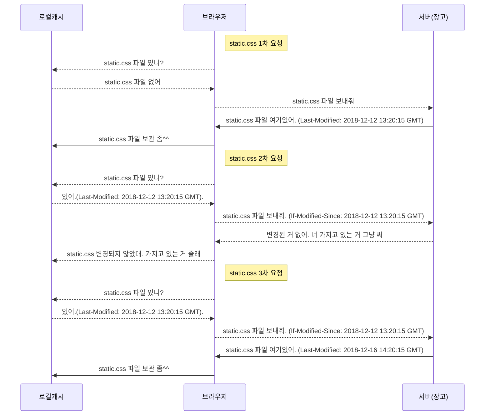

## 1. STATIC 파일 분리

벌써 bbs 앱에서 4 페이지, user 앱에서 3 페이지의 화면을 만들었습니다. 화면이 점점 많아지다보니 어쩔 수 없이 코드가 복잡해지고 중복되는 부분들이 많이 있어 한번쯤 쉬면서 코드를 정리해 보는 게 좋습니다. 우선 가장 문제가 있어보이는 부분은 템플릿입니다. 뷰와 모델은 조금씩 리팩토링을 해왔는데 템플릿은 ~~귀찮아서~~ 상대적으로 복잡도가 낮아 미루고 있었습니다. 더 늦어지기 전에 템플릿도 리팩토링을 해두도록 하겠습니다.  

### static 파일을 분리하는 이유
보통 css나 javascript를 html 또는 템플릿에 포함시키지 않습니다. 왜냐하면 css 나 javascript 는 서버에서 매번 렌더링 할 필요없이 모든 사용자에게 동일하게 적용됩니다. 다른 말로 표현하자면, css나 javascript 에는 데이터베이스에 저장된 값을 적용하거나 템플릿태그를 적용할 일이 없습니다. 간혹 서버에서 렌더링해야 할 필요가 있는 경우도 있지만 예외적인 케이스입니다. html은 반대로 서버에서 매번 새로 생성해야 하는 부분이기 때문에 어쩔 수 없이 매 요청마다 렌더링 후 전송을 해야합니다. 이렇게 서버에서 매번 새로 생성해줘야 하는 코드를 동적(dynamic) 코드라고 하고 css, javascript, image 와 같이 매번 새로 생성할 필요가 없는 코드를 정적(static) 코드라고 합니다. 정적 코드는 각 종류에 따라 css, js 등의 파일로 관리를 하고 정적 파일은 서버와 브라우저에서 아래와 같이 관리합니다.

(1차요청) 장고(또는 웹서버)에서 정적파일을 전송할 때 `Last-Modified` 헤더에 파일의 최종 수정된 시간을 표시합니다.  
(2차요청) 브라우저는 전송받은 정적파일을 로컬에 저장했다가 다음 번에 동일한 파일을 서버에 요청할 때 `If-Modified-Since` 헤더에 `Last-Modified` 헤더의 값(최종 변경된 시간)을 표시해서 요청하고, 서버는 요청 헤더에 `If-Modified-Since` 가 있으면 해당 **파일의 최종 수정시간이 `If-Modified-Since` 보다 작거나 같으면 파일은 보내지 않고** 변경된 내용이 없다는 응답(`304, NotModified`)만 합니다.  
(3차요청) 브라우저는 그 정적파일을 로컬에 저장했다가 다음 번에 동일한 파일을 서버에 요청할 때 `If-Modified-Since` 헤더에 `Last-Modified` 헤더의 값(최종 변경된 시간)을 표시해서 요청하고, 서버는 요청 헤더에 `If-Modified-Since` 가 있으면 해당 파일의 최종 수정시간이 `If-Modified-Since` 보다 이후 시간일 경우는 다시 파일을 전송하고 `Last-Modified` 헤더에 파일의 최종 수정된 시간을 표시합니다.

이런식으로 처리하면 정적파일에 대해서 불필요한 전송을 하지 않게 되어 **서버입장에서는 파일전송에 허비하는 시간이 줄고, 브라우저입장에서는 좀 더 빠르게 화면을 표시**해줄 수 있게 됩니다. 물론 현재 여러분의 템플릿코드의 분량은 굉장히 작고 css나 javascript 가 거의 없지만 나중에는 템플릿의 절반 가량이 css와 javascript 로 구성될 수도 있습니다. 그럴 때는 이렇게 static 파일로 분리해서 운영하는 방식이 많은 도움이 많이 됩니다.

> css 나 javascript 는 정적파일로 따로 분리가 가능하지만 일반 html 태그들은 정적파일로 분리할 수가 없습니다. 장고의 템플릿처럼 중복되는 부분들을 `` 처럼 표시하면 브라우저가 알아서 다운로드하고 관리해주면 되지 않을까? 라고 생각했던 분들이 있을 수 있는데, html 표준에서 아직 그러한 기능이 제공되고 있지 않아 브라우저에서도 그런 기능을 제공하지 않습니다. 대신 브라우저를 대신해서 javascript 가 그런 역할을 대신하도록 하는 프레임워크들이 있습니다. 이것을 `spa(Single Page Application)`라고 하는데 대표적으로 `reactjs`, `vuejs`, `angularjs`, `emberjs`, `backbonejs` 등이 있습니다. spa 프레임워크는 화면을 크게 뼈대(템플릿)와 데이터로 분리해서 다루는데 뼈대는 정적파일로 관리(캐싱)하고 데이터는 동적으로 매번 서버에서 받아와 화면을 렌더링합니다.

### STATIC 설정

장고에서는 모든 요청을 `urlpatterns` 에 등록된 핸들러에 전달합니다. 브라우저가 static 파일을 다운로드 요청을 하더라도 이것에 대한 핸들러가 있어야 하는데 설정파일의 `STATIC_URL` 값이 설정되어 있으면 장고에 내장되어 있는 static 핸들러에 라우팅이 등록됩니다. 요청된 url이 설정된 `STATIC_URL` 로 시작되면 static 핸들러로 라우팅되도록 되어 있습니다. 여기서는 `STATIC_URL`로 기본설정된 `'/static/'` 을 변경지 않고 앞으로 static 파일들은 각 앱의 static 디렉토리에 저장하고, 요청하는 url도 `/static/` 으로 시작하도록 설정하겠습니다.

```python
# minitutorial/settings.py

# 생략

STATIC_URL = '/static/'

STATIC_ROOT = '/var/www/static'

STATICFILES_DIRS = []

# 생략
```

static 관련 설정이 몇가지 더 있는데 아직은 필요하지 않지만 미리 설정해두도록 하겠습니다.
1. `STATIC_URL`: 이 경로로 시작되는 요청은 static 핸들러로 라우팅
2. `STATIC_ROOT`: `collectstatic` 커맨드로 static 파일들을 모을 때 저장될 디렉토리 경로
3. `STATICFILES_DIRS`: `collectstatic` 또는 `findstatic` 커맨드 실행시 검색하는 디렉토리 경로들의 리스트. 주로 앱 내부의 static 디렉토리가 아닌 다른 곳에 저장되어 있을 경우 설정함.

`STATIC_ROOT` 는 현재 존재하는 디렉토리 경로를 설정해야 합니다. 윈도우는 예외이지만 리눅스 또는 맥에서는 `manage.py` 를 실행하는 권한으로 **디렉토리 권한이 설정**되어 있어야 합니다.(웹서버에서 static 파일을 직접 전송해야 한다면 웹서버에서 읽을 수 있어야 합니다.) 이미 잘 설정되어 있는 경우는 상관없으나 새로 디렉토리를 생성해야 한다~~거나 무슨 말인지 모르겠다~~면 아래 명령어를 사용해보세요.
```bash

(test-venv-36) $ sudo mkdir -p /var/www/static
(test-venv-36) $ sudo mkdir -p /var/www/static
(test-venv-36) $ sudo chown `whoami`:`id -g -n` /var/www/static/
```
이제 앞으로 /static/ 으로 시작하는 url 은 장고의 static 핸들러가 자동으로 처리해 줄 것 입니다.

> 2, 3 번의 설정은 collectstatic 커맨드를 사용할 때 필요한 것들인데 이것들이 잘 설정되었다면 `collectstatic` 커맨드를 실행했을 때 `STATIC_ROOT`('/var/www/static')의 경로에 static 파일들이 복사될 것입니다. 이것은 나중에 static 파일들을 생성 후 테스트해보겠습니다.

### CSS 분리


우선 부트스트랩 css 는 대부분의 페이지에서 필요하니 base.html 로 옮기겠습니다. base.html 의 css 블록에 해당 태그(`<link rel="stylesheet" href="https://maxcdn.bootstrapcdn.com/bootstrap/3.3.2/css/bootstrap.min.css">`)를 추가하고 나머지 템플릿들에서는 해당 라인을 대신해서 `{{ block.super }}` 를 추가합니다. **css 블록 안에 `{{ block.super }}` 만 남는 경우는 과감히 css 블록을 삭제**합니다.


그리고 각 템플릿들의 css 블록 안에 있는 css 코드들을 css 파일로 따로 분리합니다. 각 앱 별로 css는 따로 관리할 예정입니다. css 뿐만 아니라 javascript, 이미지 등의 파일도 모두 각 앱의 static 라는 디렉토리 안에서 관리하도록 하겠습니다. 모든 앱들의 static 파일들을 앱구분없이 하나의 디렉토리에서 관리할 수도 있습니다. 하지만 이렇게 되면 앱들을 다른 프로젝트에서 재사용할 수 없게 됩니다. **bbs 나 user 앱을 다른 프로젝트에서도 재사용하고 싶다면 반드시 static 파일들을 각자의 앱 내부에 저장**해주세요. 

각 앱별로 static 디렉토리를 생성하고 그 안에 앱이름의 디렉토리를 다시 생성하고 그 안에 css, js, img 라는 디렉토리를 생성합니다. 먼저 bbs 앱의 `article_list.html` 템플릿부터 분리하겠습니다.

```html
<!-- bbs/templates/article_list.html -->





<title>게시글 목록</title>


{{ block.super }}
<link rel="stylesheet" href="">



<table class="table table-hover table-responsive">
    <thead>
        <th>번호</th><th>제목</th><th>작성자</th>
    </thead>
    <tbody>
        
        <tr onclick="location.href='/article/{{ article.pk }}/'">
            <td>{{ article.pk }}</td><td>{{ article.title }}</td><td>{{ article.author }}</td>
        </tr>
        
    </tbody>
</table>

<a href="/article/create/"><button class="btn btn-primary" type="button">새 게시글 작성</button></a>

```
부트스트랩 css와 마찬가지로 헤더에 `<link rel="stylesheet" href="/static/css/bbs.css">` 라고 표기하면 `'/static/css/bbs.css'` 파일을 css로서 사용하겠다는 선언입니다. 이렇게 해도 지금은 잘 동작하지만 문제는 여러분의 앱이 다른 프로젝트에서 사용될 때 해당 프로젝트의 `STATIC_URL` 설정이 '/static/' 이 아니면 어떻합니까? 그러면 앱의 모든 템플릿을 override 해야 하는데 그렇게 하기에는 너무 번거로운 일이 될 것입니다. 장고에서는 설정파일의 `STATIC_URL` 설정을 신경쓰지 않고 유연하게 static 파일을 설정할 수 있는 템플릿태그를 제공합니다. static 이라는 태그인데 href 속성에 static 템플릿태그를 이용해서 설정파일의 `STATIC_URL` + '/css/bbs.css' 로 변환됩니다. 즉, `` 는 settings.`STATIC_URL + '/css/bbs.css'` 와 같습니다. static 템플릿태그 사용할 때는 반드시 템플릿상단에 `` 를 추가하셔서 템플릿엔진에서 static 템플릿태그를 사용할 수 있게 로딩해줘야 합니다.


분리된 css 는 `bbs/static/css/bbs.css` 파일에 그대로 붙여넣기 해줍니다. 단 css 파일 내부에는 `<style></style>` 태그가 있어서는 안됩니다. 순수 css 만 넣어주세요.

```css
/* bbs/static/css/bbs.css */

tbody > tr {cursor: pointer;}
```

> 실제 서비스에서 css, javascript, image 같이 정적인(static) 파일들은 장고를 통하지 않고 nginx 와 같은 웹서버가 직접 파일을 읽어서 전송하는 것이 효율적입니다. **장고에 비해 nginx 의 성능은 뛰어나며 동시에 여러 요청을 처리할 수 있기 때문에 단순한 파일 전송은 웹서버가 직접 처리**하는 것입니다. 웹서버에 특정 파일들은 직접 처리하라는 설정을 해줘야 하는데 모든 파일들을 일일이 설정하기에는 복잡하고, 앱마다 정적파일들이 저장된 디렉토리가 다르기 때문에 웹서버에 설정하기가 쉽지 않습니다. 장고는 `collectstatic` 이라는 커맨드를 통해 각 앱의 static 디렉토리와 설정파일에 설정된 `STATICFILES_DIRS` 디렉토리들을 하나의 디렉토리에 모아둡니다. 이 때 동일한 경로에 동일한 경로의 동일한 이름의 파일이 있으면 오류가 발생합니다. 그래서 css 이름을 서로 다르게 만들었습니다. 이렇게 여러 앱들의 정적파일들이 하나의 디렉토리에 모이게 되면 웹서버에서 하나의 `urlpattern` 만 설정해도 정적파일들을 처리할 수 있습니다. 이후 `collectstatic` 커맨드를 설명할 때 자세히 설명하겠습니다.

그 다음으로 user 앱의 css 를 분리합니다. `login_form.html`, `resend_verify_email.html`, `user_form.html` 세 템플릿이 거의 비슷한 css를 가지고 있습니다. 이것을 하나의 css(user.css)에서 모아두면 효율적일 것 같습니다. css의 selector로 클래스 `registration` 이 있는데 세 템플릿 모두에게 적용하기에는 일반적인 용어는 아닙니다. 그래서 좀 더 추상적이고 일반화된 이름(`user-panel`)으로 변경합니다. `login_form.html` 에는 css 코드가 한 줄 더 있는데 이것도 user.css 파일에 추가합니다.

```css
/* user/static/css/user.css */


.user-panel {
    width: 360px;
    margin: 0 auto;
}
p {
    text-align: center;
}
label {
    width: 50%;
    text-align: left;
}
.control-label {
    width: 100%;
}
.user-panel .form-actions > button {
    width: 100%;
}
.link-below-button { margin-top: 10px; text-align: right;}

```


당연히 각 템플릿의 css 블록은 `{{ block.super }}` 와 `<link rel="stylesheet" href=" ">` 만 남기고 모두 삭제합니다.  


## 2. 템플릿 분리

회원가입과 로그인의 템플릿이 거의 동일하게 생겨서 왠지 하나의 템플릿을 사용해도 될 것 같습니다. 하나의 템플릿만으로도 회원가입뷰에서 렌더링할 때는 회원가입으로 보이고, 로그인뷰에서 사용할 때는 로그인으로 보이도록 if-else 템플릿태그를 사용하면 가능하긴 합니다만 그렇게 하지 않을 예정입니다. 혹시나 비슷한 페이지들이 늘어나고 약간씩 달라지는 경우가 많이 있을 수 있는데 그럴 때마다 분기 처리를 한다면 템플릿자체가 너무 복잡하고 나중에는 유지보수 하기 힘들어지는 경우가 많이 있기 때문입니다. 중복되는 부분은 템플릿을 따로 분리해서 필요한 템플릿에서 추가해서 사용하도록 하겠습니다.

### 템플릿 include
user 앱에서 각 템플릿들의 공통된 부분들을 따로 분리하는데 이번에는 `extends` 템플릿태그로 상속받는 것이 아니라 **`include` 템플릿태그를 이용해서 템플릿의 일부를 분리**시키는 방법을 사용해보도록 하겠습니다. 먼저 예시로` user_form.html` 템플릿의 `for` 블록을 분리합니다. `form_field.html` 템플릿 파일을 생성해서 분리한 내용을 저장합니다.
```html
<!-- user/templates/user/partials/form_field.html -->



<div class="form-group has-error">
    <label for="{{ field.id_for_label }}">{{ field.label }}</label>
    <input name="{{ field.html_name }}" id="{{ field.id_for_label }}" class="form-control" type="{{ field.field.widget.input_type }}" value="{{ field.value|default_if_none:'' }}">
    
        <label class="control-label" for="{{ field.id_for_label }}">{{ error }}</label>
    
</div>


```

이제는 `user_form.html` 템플릿에서 분리된 내용을 삭제하고 `include` 템플릿태그를 이용해서 분리한 템플릿을 불러서 삽입합니다.
```html
<!-- user/templates/user/user_form.html -->

<!-- 생략 -->

<form action="." method="post">
    
    
    <div class="form-actions">
        <button class="btn btn-primary btn-large" type="submit">가입하기</button>
    </div>
</form>

<!-- 생략 -->
```

삽입되는 템플릿에 데이터(argument)를 전달할 때는 with 구문으로 인자를 넘겨줄 수 있습니다.(`with form=form`) form=form 의 좌변은 keyword argument 의 키이름이고, 우변은 전달시킬 데이터입니다. `form=form` 이라고 값을 넘겨주면 `form_field.html` 에서 form 이라는 데이터를 동일한 이름의 파라미터로 사용하도록 전달한다는 의미입니다.

복잡한 `if-else` 템플릿태그 없이 user 앱의 세가지 템플릿의 중복을 이렇게 최소화했습니다. 아까 설명했던 것처럼 하나의 템플릿을 사용하고 중간에 텍스트 몇개만 `if-else` 로 변경할 수도 있겠지만 **`if-else` 가 가독성에 그다지 좋지 않다는 개인적인 의견이 있고, 앞으로 더 복잡하게 변할 수 있다**는 생각이 있어 이렇게 분리하는 리팩토링을 했습니다. 

마지막으로 템플릿 이름을 좀 일관성 있게 변경하도록 하겠습니다. `user_form.html` 을 `registration_form.html` 으로 변경하고 `resend_verify_email.html` 을 `resend_verify_form.html` 으로 변경하고 각 뷰에도 변경된 템플릿 이름으로 설정하도록 하겠습니다.  
변경된 템플릿은 정리된 내용을 보고 맞게 리팩토링이 됐는지 확인해보세요. 뷰에서 `template_name` 변수를 변경하는 것은 직접 변경해보세요.


```html
<!-- user/templates/registration_form.html -->





<title>회원 가입</title>


{{ block.super }}
<link rel="stylesheet" href="">



<div class="panel panel-default user-panel">
    <div class="panel-heading">
        가입하기
    </div>
    <div class="panel-body">
        <form action="." method="post">
            
            
            <div class="form-actions">
                <button class="btn btn-primary btn-large" type="submit">가입하기</button>
            </div>
        </form>
    </div>
</div>

```

```html
<!-- user/templates/resend_verify_form.html -->





<title>인증이메일 재발송</title>


{{ block.super }}
<link rel="stylesheet" href="">



<div class="panel panel-default user-panel">
    <div class="panel-heading">
        인증이메일 발송
    </div>
    <div class="panel-body">
        <form action="." method="post">
            
            <b class="">재발송할 이메일주소를 입력해주세요.</b>
            
            <div class="form-actions">
                <button class="btn btn-primary btn-large" type="submit">인증이메일 발송</button>
            </div>
        </form>
    </div>
</div>

```

```html
<!-- user/templates/login_form.html -->





<title>로그인</title>


{{ block.super }}
<link rel="stylesheet" href="">
<style>
    .link-below-button { margin-top: 10px; text-align: right;}
</style>



<div class="panel panel-default user-panel">
    <div class="panel-heading">
        로그인하기
    </div>
    <div class="panel-body">
        <form action="." method="post">
            
            
            <div class="form-actions">
                <button class="btn btn-primary btn-large" type="submit">로그인하기</button>
            </div>
            <a href="/user/resend_verify_email/">
                <div class="link-below-button">인증이메일 재발송</div>
            </a>
        </form>
    </div>
</div>

```


## 3. STATIC 파일 모으기

위에서 몇번 소개해드린 대로 `collectstatic` 커맨드를 이용해 각 앱의 static 파일들을 하나의 디렉토리에 모아둘 수 있습니다. `collectstatic` 커맨드를 실행하기 위해서는 [설정]({{ pate.url }}#static-설정) 이 되어 있어야 합니다. `collectstatic` 커맨드는 설정파일의 `STATICFILES_FINDERS` 로 추가된 탐색기에게 static 파일들을 검색을 위임합니다. 기본으로 추가되어 있는 검색기의 기능을 간단히 살펴보겠습니다.

1. 'django.contrib.staticfiles.finders.FileSystemFinder' - `STATICFILES_DIRS` 에 설정된 디렉토리들를 검색합니다.
2. 'django.contrib.staticfiles.finders.AppDirectoriesFinder' - 각 앱의 static 디렉토리를 검색합니다.

`FileSystemFinder` 는 bower 등을 통해서 프론트엔드 라이브러리(css, js)들을 관리할 경우 앱과는 별도의 위치에 저장하는데 이럴 때 `STATICFILES_DIRS` 에 해당 디렉토리들을 추가해서 static 파일들을 모을 수 있게 합니다.  
`AppDirectoriesFinder` 는 항상 사용하도록 하고 앱에서 생성한 static 파일들은 항상 앱 내부의 static 디렉토리에 저장하고 static 디렉토리 내에 앱이름의 디렉토리를 다시 만들어 `collectstatic` 커맨드로 파일들이 모일 때 이름이 겹쳐져서 오류가 나지 않도록 해야 합니다.

더 깊은 설명보다는 실제로 collectstatic 커맨드를 실행해서 실제로 잘 모이는 지 확인해봅니다.
```bash
(test-venv-36) $ ./manage.py collectstatic
125 static files copied to '/var/www/static'.
(test-venv-36) $ ls /var/www/static/
admin   bbs     user
```
`collectstatic` 커맨드를 실행할 경우 오류가 발생하지 않으면 몇개의 파일이 복사가 되었는지 결과 화면에 출력합니다. 저장되는 디렉토리의 파일리스트를 보면 admin, bbs, user 디렉토리가 출력이됩니다. admin 프레임워크도 앱이기 때문에 admin 앱의 정적파일들도 자동 수집이 됩니다.  

만일 모이는 파일들이 경로와 이름이 겹치게 되면 아래와 같은 오류가 발생합니다.
```bash
(test-venv-36) $ ./manage.py collectstatic
Found another file with the destination path 'css/common.css'. It will be ignored since only the first encountered file is collected. If this is not what you want, make sure every static file has a unique path.
```
`STATICFILES_DIRS` 설정을 할 때 디렉토리들을 튜플로 설정하는데, 만일 추가할 디렉토리가 1개일 때 쉼표(,)를 생략할 경우도 오류가 발생합니다. 해당 오류가 발생하면 아래와 같은 메시지가 출력됩니다. 이럴경우 `STATICFILES_DIRS에` 설정된 디렉토리명 뒤에 쉼표(,)를 추가해주시면 됩니다.

```bash
(test-venv-36) $ ./manage.py collectstatic
SystemCheckError: System check identified some issues:

ERRORS:
?: (staticfiles.E001) The STATICFILES_DIRS setting is not a tuple or list.
        HINT: Perhaps you forgot a trailing comma?

```
> 파이썬에서 튜플의 **원소갯수가 1개일 경우 마지막 원소 뒤에 쉼표(,)를 표시하지 않으면 자동으로 튜플을 언패킹**합니다. 이 점 주의하세요.

개발업무를 하다보면 바쁘기도 하고, 귀찮기도 하고, 때로는 더 좋은 방법을 몰라서 당시에 편한 방법으로 개발을 하곤 합니다. 하지만 이것을 그대로 놔두면 언젠가는 스파게티가 되기 때문에 스파게티가 되기 전에 정기적으로 리팩토링을 검토해보세요. 

> 컴퓨터가 이해할 수 있는 코드는 어느 바보나 다 짤 수 있다. 좋은 프로그래머는 사람이 이해할 수 있는 코드를 짠다.
>
> 마틴 파울러, 이 글귀는 어느 것 하나 손댈 수 없다.